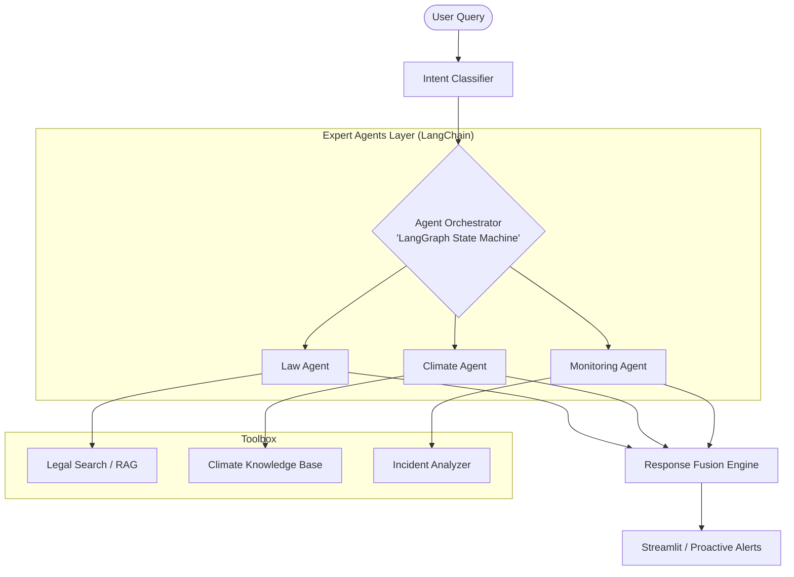

# Implementation Plan: Phase 2 - Agentic AI Integration

This plan outlines the transition of GreenLaw AI from a specialized RAG system into a **Hybrid Multi-Agent System** using **LangGraph** and **LangChain**.

## 🏗️ System Architecture

---

## 📅 Roadmap: Start & End Criteria

| Week       | Focus                    | **How we Start**                                                                  | **How we End (Goal)**                                                   |
| :--------- | :----------------------- | :-------------------------------------------------------------------------------- | :---------------------------------------------------------------------- |
| **Week 1** | **Foundation & Intent**  | Audit existing RAG logic and create new directories (`src/agents`, `src/intent`). | `IntentClassifier` correctly routing 95% of test queries to stubs.      |
| **Week 2** | **Agent Specialization** | Define the global `State` for **LangGraph** and implement `BaseAgent`.            | Three specialized agents (Law, Climate, Monitor) working independently. |
| **Week 3** | **Integration & Fusion** | Connect agent nodes in the Graph and implement the `FusionEngine`.                | End-to-end query flow from UI -> Orchestrator -> Multi-Agent Response.  |
| **Week 4** | **Verification & OPS**   | Initial performance profiling and stress testing.                                 | Final completion report with >90% routing accuracy and <2s latency.     |

---

## 🔍 Detailed Methodology: Week 1

### How will we do Week 1?
We will adopt a **"Standardize & Separate"** approach. We must decouple the current retrieval logic from the UI to make it a generic "Tool" that any agent can call.

**Step-by-Step Execution:**
1.  **Restructure**: Create the folder hierarchy (`src/agents`, `src/tools`, `src/intent`).
2.  **Toolification**: Wrap `src/retrieval/graph_rag_retriever.py` into a `LegalSearchTool` (LangChain-compatible).
3.  **Intent Engine**: 
    - Implement a `Classifier` that uses **Regular Expressions** (fast) combined with an **LLM-fallback** (accurate).
    - Map queries like "What is the penalty...?" to `legal` and "Carbon impact...?" to `climate`.
4.  **Base Class**: Implement `BaseAgent` to ensure every agent we build in Week 2 has consistent logging and state management.

---

## 🛠️ Technical Stack Deep Dive

### 🤖 Why LangGraph + LangChain?
For a multi-agent system, **LangGraph** is the superior choice because it allows for **State Management** and **Cyclic Reasoning** (agents can talk back and forth). Each agent is built using **LangChain** for its rich tool-calling ecosystem.

### Key Libraries
- **Orchestration**: `langgraph`
- **Agent Framework**: `langchain-core`
- **NLP**: `spacy` (for Legal NER)
- **Background Tasks**: `APScheduler` (for Monitoring Agent)

---

## 🎯 Deliverables Checklist

- [ ] **Law Agent**: Full legal reasoning with 2022 Amendment awareness.
- [ ] **Climate Agent**: Carbon calculation tools for specific tree species.
- [ ] **Monitoring Agent**: Anomaly detection logic for illegal logging trends.
- [ ] **Intent Classifier**: Routing logic for `legal`, `climate`, and `monitoring` intents.
- [ ] **Response Fusion**: Engine to synthesize multi-agent insights into one answer.
- [ ] **Proactive UI**: Streamlit sidebar for real-time alerts.

---

## ✅ Verification Plan

### Automated Testing
- **Routing Success**: Queries like "Deodar penalties" must route to Law Agent with >90% confidence.
- **Collaboration Test**: "Climate impact of illegal logging" must trigger both agents via LangGraph's multi-node traversal.

---
> [!IMPORTANT]
> **Week 1 Action Item**: Standardizing the folder structure is the very first task to prevent import circularity as the system scales.
