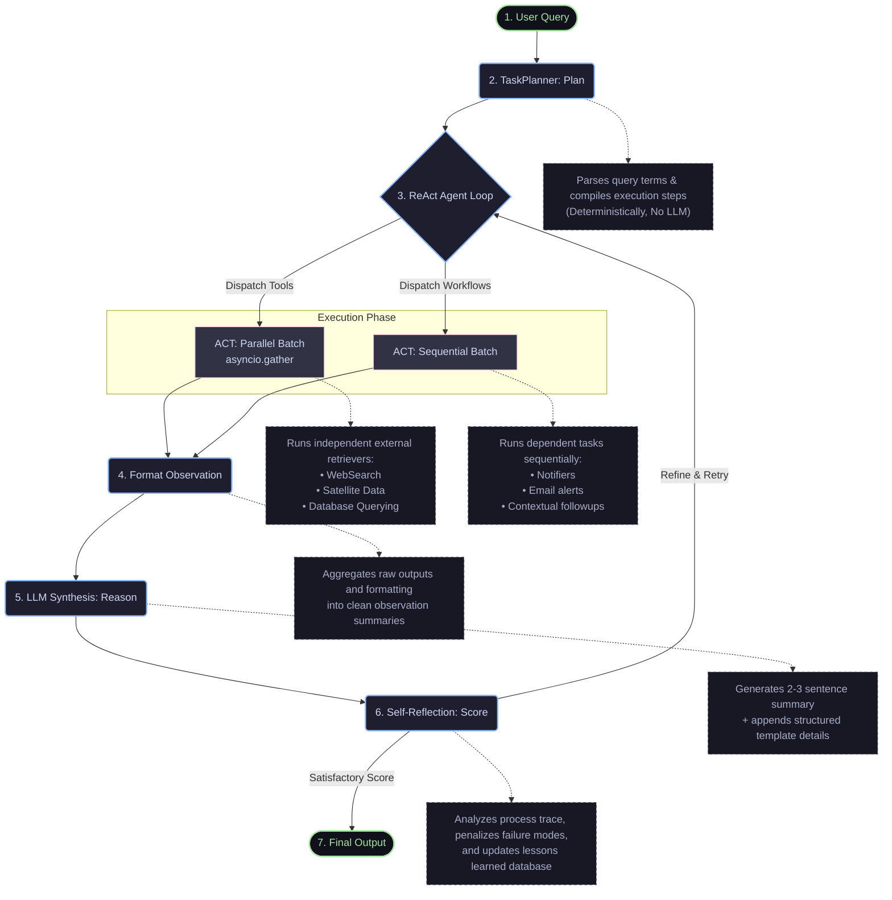

# GreenLaw AI: ReAct Agent Loop Reasoning Flowchart

This document details the autonomous agent execution flow within the **GreenLaw AI** system. It visualizes the step-by-step process of handling a user query from ingestion, planning, parallel tool execution, synthesis, self-reflection, and final output generation.

---

## 1. Graphical Flowchart (Mermaid)

This diagram can be rendered directly by any markdown viewer that supports Mermaid (e.g., GitHub, VS Code, Obsidian, Notion).



---

## 2. Text-Based Flowchart (ASCII/Unicode)

If you need to copy-paste this flowchart into plain text environments (e.g., source code comments, Slack, Microsoft Teams, or standard emails), use this representation:

```text
       [User Query]
            │
            ▼
   [TaskPlanner: Plan] ───────────────► Parses terms & compiles steps (Deterministic, No LLM)
            │
            ▼
      ┌─►[ReAct Loop]
      │     │
      │     ├─► [ACT: Parallel Batch] ──► Runs WebSearch, Satellite, etc. (via asyncio.gather)
      │     │
      │     └─► [ACT: Sequential Batch] ► Runs Notifiers sequentially using parallel data
      │     │
      │     ▼
      │  [Format Observation] ────────► Aggregates raw outputs into observation summaries
      │     │
      │     ▼
      │  [LLM Synthesis: Reason] ─────► Generates a 2-3 sentence overview + detailed template
      │     │
      │     ▼
      └─ [Self-Reflection: Score] ────► Analyzes trace, penalizes failures, and generates lessons
            │
            ▼
      [Final Output]
```

---

## 3. Pipeline Step Descriptions

| Step | Component | Execution Details |
| :--- | :--- | :--- |
| **1** | **User Query** | Ingestion point where user inputs natural language queries regarding environmental law, regulatory checks, or compliance reports. |
| **2** | **TaskPlanner: Plan** | Parses terms and compiles steps deterministically without LLM calls to minimize latency and ensure structured subtask breakdown. |
| **3** | **ReAct Agent Loop** | The orchestrator coordinating tool actions, monitoring run results, and dynamically adapting tool invocation parameters. |
| **4** | **ACT (Parallel & Sequential)** | **Parallel:** Concurrent execution of IO-bound operations (e.g., Satellite, WebSearch APIs) using `asyncio.gather`. <br>**Sequential:** Logic-dependent steps executed step-by-step using data resolved from the parallel batch. |
| **5** | **Format Observation** | Raw JSON outputs from API responses and tool logs are cleaned, summarized, and restructured into Markdown tables or bulleted lists. |
| **6** | **LLM Synthesis: Reason** | Takes clean observations and produces a concise summary (2-3 sentences overview) along with an appended, detailed report template. |
| **7** | **Self-Reflection: Score** | A safety and quality check. Analyzes execution logs to penalize hallucinated steps or failed lookups, feeding feedback loops or terminating to produce the **Final Output**. |
